# 欢迎使用Fymew

## Fymew是什么

Fymew (音：/faɪ mjuː/)，是Fly music的近音提取，意为轻盈、自由的听音乐。

> 注意：
> - Fymew仅支持Mp3、flac的格式
> - 没有音源、引用歌曲意外被删除等情况使用默认音乐代替
> - 歌曲的删除权只能在乐库模式下时候使用
> - 部分功能是随时更新且需要联网的

## Fymew的管理方式

Fymew核心包括主页、乐库和用户栏三个界面。

## 主页

如图示，界面从上到下，分别是用户信息、功能区和底部导航栏。

其中，核心的功能区分为3个面板，分别是工具箱、收藏和队列。

### 工具箱

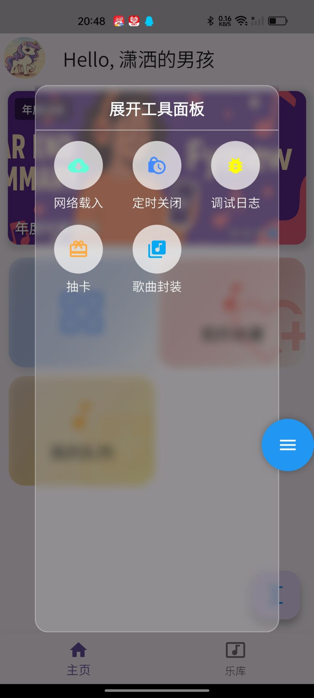

点击工具箱，会弹出如下毛玻璃界面，每个按钮都是一个功能按钮

- 网络载入：如下图，从任意合法源载入歌曲，包括在线听（只会临时播放一次，核心是支持临时重播、单曲循环）、临时加入乐库（即软件启动到销毁途中，歌曲始终存放在乐库，核心是支持大部分播放操作）、下载至乐库（跟把本地歌曲导入一样的效果）。网络载入仅读不写，也就是说，一些歌曲源没有歌手、封面等元数据只能被默认处理。另外，该功能乐库也有，无非多这个多了一个跳转到乐库的功能。
    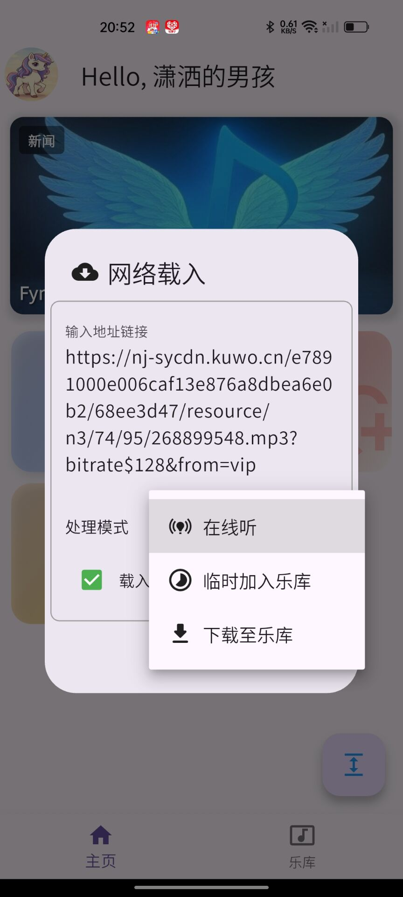
- 定时关闭：如下图，你可以定时，到时间就关闭播放了（无论你听不听歌曲）。定时范围1min~180min。定时器再定时可以覆盖之前的定时器、销毁可以取消定时。定时器的事件可以在任务栏的右下角看到。如下一个图。
    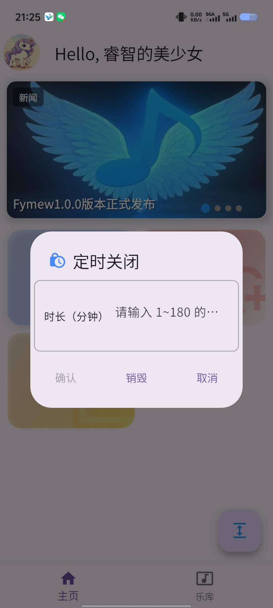
      
    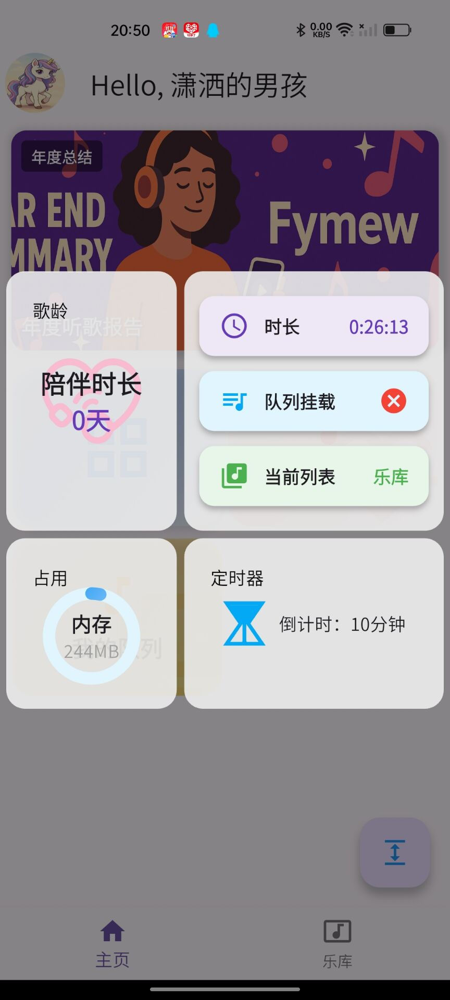
- 调试日志：这个一半用不到，如果遇到bug，可以查看向我反馈。
- 抽卡：抽卡系统从乐库随机抽一首歌曲推荐，图片源是可以更新的，保存图片会生成卡片在系统图库。
- 歌曲封装：永久保存一首源自网络的合法源歌曲，如果链接合法，会立即生成歌曲信息（否则会报错）。生成信息后，可以看到歌曲封面、名字、歌唱者是否信息完整，不完整可以修改，封面来源于给定的网络源（仅支持png、jpg），可以点击检测查看图片是不是能读取到，如果成功的话会替换封面。比如说这首《See you again》为例，成功后和网络载入一样添加在乐库尾部。
    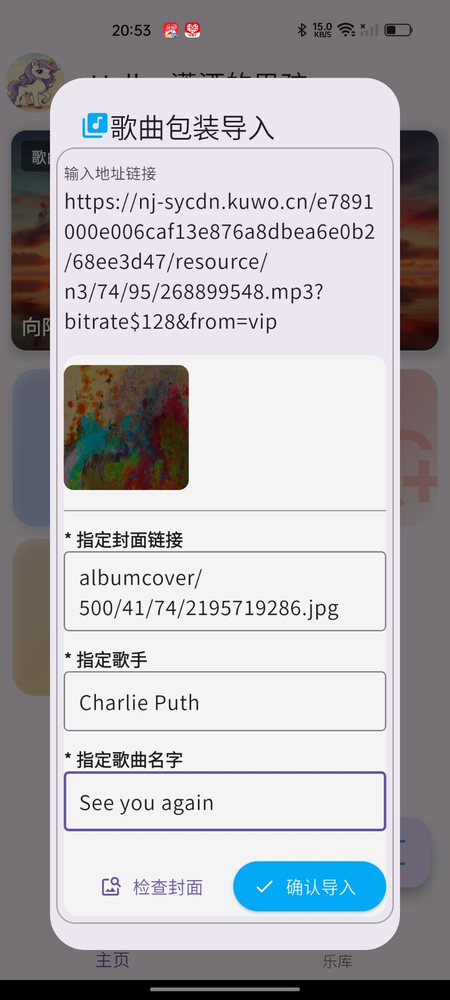
      
    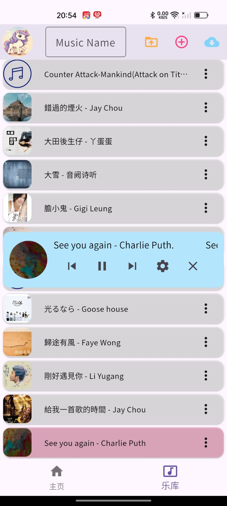

### 我的收藏
收藏的歌曲被视为一个永久歌单，歌曲会在歌单中循环播放。歌曲只能从收藏中移除，收藏模式下，歌单空的时候，会变成默认音乐。

### 我的队列
队列是优先级最高的临时歌单，无论是在播放收藏、乐库还是网络在线，下一首歌曲的出发点始终是队列歌曲（*如果有*）

> 注：
> - 队列模式必须在顺序播放前提下才能设置，非顺序播放会情况队列
> - 队列的核心功能是为了实现AABABABASDCSWWAACACAS这种自定义歌曲播放方式，也是为什么我要制作Fymew的终极原因
> - 队列卡片是可以长按拖动更改播放顺序的
> - 队列卡片也可以是被移除的
> - 如果队列在播放队列的最后一首歌曲，且该歌曲被删除或者播放完毕，队列会被清空，等待下一轮队列的重新创建
> - 正在播放的队列歌曲被暂停状态下移除，后面的歌曲会直接播放
> - 乐库的歌曲删除时，收藏中对应的也会被删除，但是队列不会

<table style="width:100%;">
  <tr>
    <td align="center" width="33%">
      <strong>操作演示：自定义队列</strong> 
      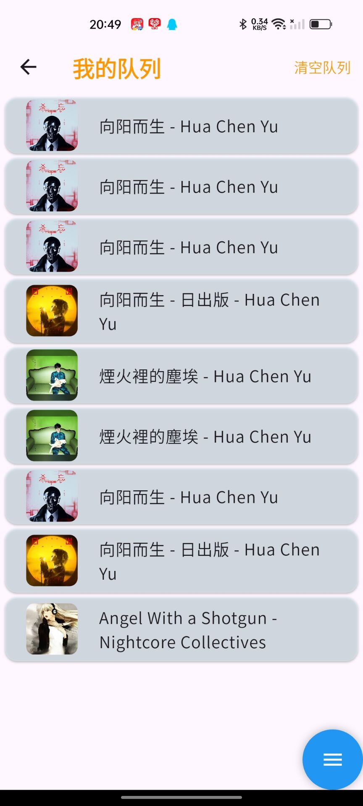
    </td>
    <td align="center" width="33%">
      <strong>操作演示：移动队列卡片</strong> 
      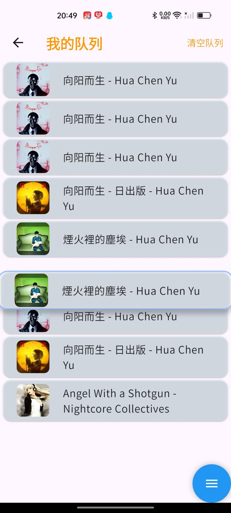
    </td>
    <td align="center" width="33%">
      <strong>操作演示：移除队列的某首歌曲</strong> 
      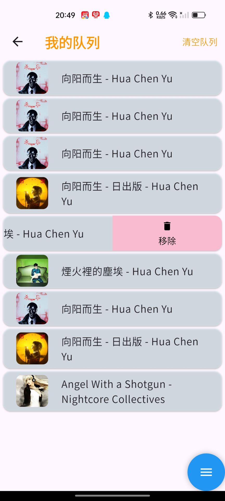
    </td>
  </tr>
</table>

### 轮播面板
轮播面板种类和个数都是可随时更新的。

轮播面板分为以下种类：
- 歌曲推荐：歌曲可以试听，也可以永久被下载到乐库（能重复下载）。
- 年度总结：一些信息面板
- 新闻面板：嵌入一些网页为主的内容

<table style="width:100%;">
  <tr>
    <td align="center" width="50%">
      <strong>操作演示：音乐推荐试听</strong> 
      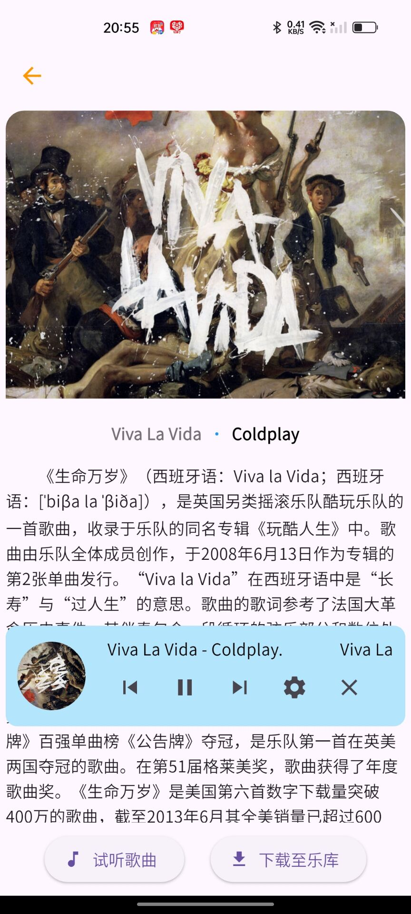
    </td>
    <td align="center" width="50%">
      <strong>操作演示：年度听歌报告</strong> 
      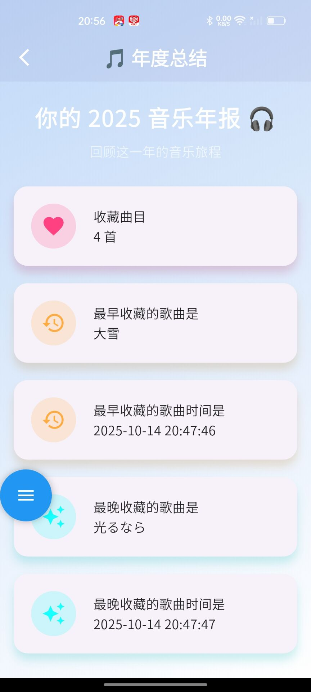
    </td>
  </tr>
</table>

### 任务面板

即右下角的浮动按钮，点击可以看到定时器是否设置、内存占用等信息

## 乐库
> 乐库的设计是为了管理本地的各处音乐，只是引用并不是把歌曲本体也复制了一份。因此，歌曲被删除的时候，乐库会去除删除歌曲的记录信息。乐库音乐的删除 ≠ 本地歌曲的删除。网络下载的歌曲也会被保存在软件的本地存储中
> 

